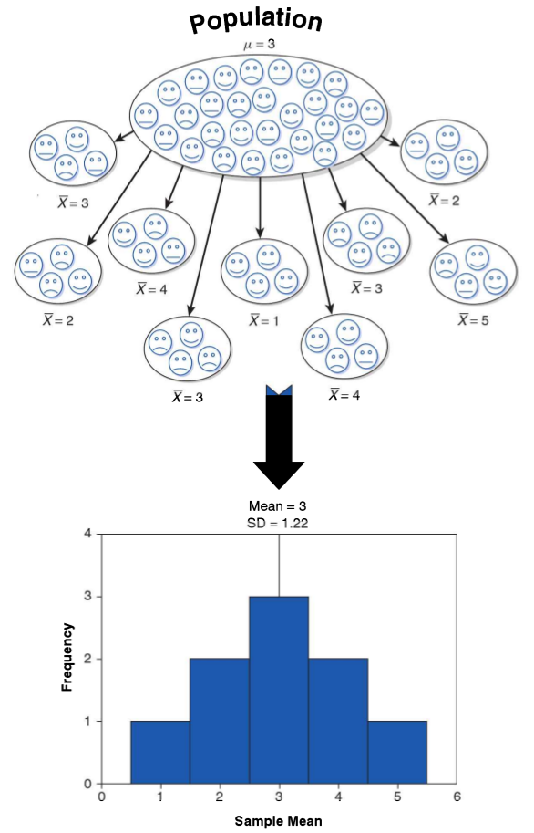
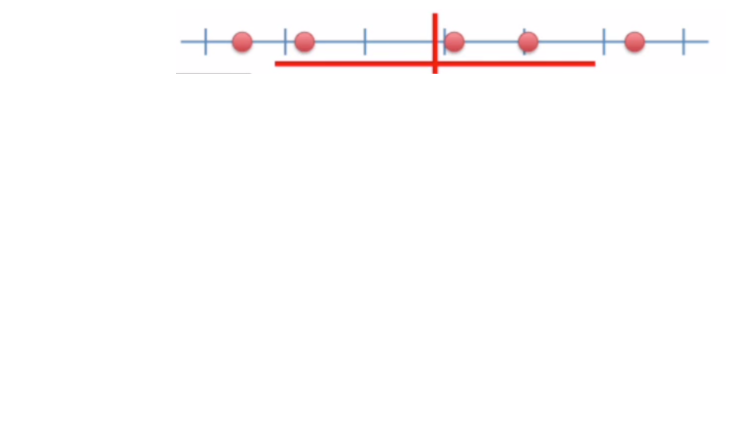
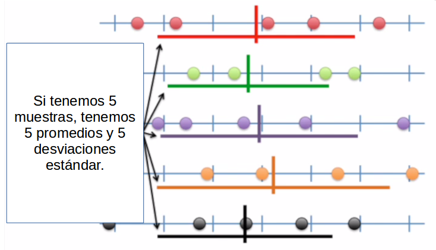
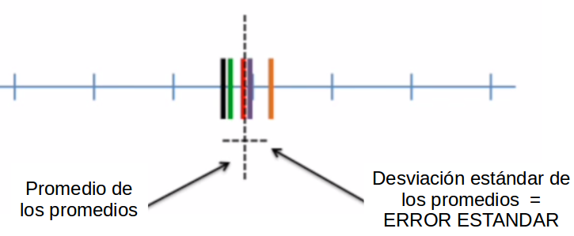
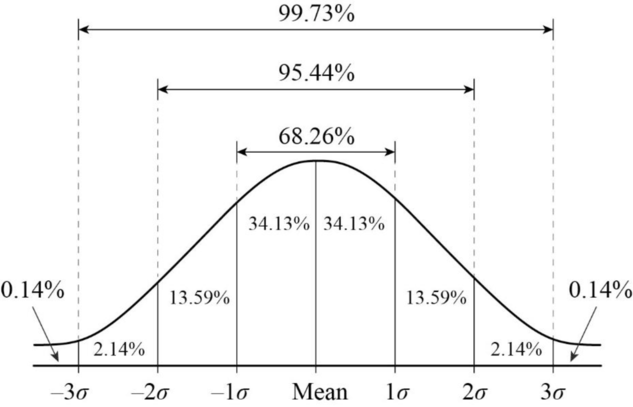

## ¿Qué vimos la sesión pasada?
::: {.incremental}
- Estadística descriptiva básica
- Verbos de dplyr
- Nuestra base de datos: superhéroes
:::

---

## Hoy: 
::: {.incremental}
- Error estándar
- Intervalos de confianza
- Cómo redactar una hipótesis estadística
:::

---

## Inferencia estadística
### Qué es?

La **inferencia estadística** es el proceso de utilizar datos de una muestra para hacer estimaciones o pruebas sobre una población más grande. Nos permite tomar decisiones o hacer predicciones basadas en la información obtenida de la muestra, en lugar de tener que examinar toda la población.

---

## Inferencia estadística
### Para qué?

Se realiza por temas de 

::: {.incremental}
- Costos: Es más económico y rápido analizar una muestra que toda la población.
- Tiempo: Recopilar datos de toda la población puede ser muy lento.
- Accesibilidad: A veces no es posible acceder a toda la población.
:::

---

## Inferencia estadística

{width="105%" fig-align="center"}

---

## Error estándar
El **error estándar** es una medida de la variabilidad de una estadística muestral, como la media o la proporción, y nos indica cuánto podemos esperar que varíe esa estadística de una muestra a otra. En otras palabras, nos dice qué tan precisos son nuestros estimadores de la población.

---

## Error estándar visualizado: Paso 1

{width="75%" fig-align="center"}

---

## Error estándar visualizado: Paso 2

{width="75%" fig-align="center"}

## Error estándar visualizado: Paso 3

{width="75%" fig-align="center"}

## Curva normal

{width="90%" fig-align="center"}

#### Características
::: {.incremental}
- Moda, mediana y media coinciden al centro.
- Simétrica.
- Áreas bajo la curva de acuerdo a desviaciones estándar del promedio (concentran cierto porcentaje de la muestra).
:::

---

## Teorema del límite central

Cuando se toman muestras aleatorias de una población, la distribución de la media muestral tiende a ser normal, independientemente de la forma de la distribución de la población original, siempre que el tamaño de la muestra sea suficientemente grande (generalmente **n > 30**).

---

## Teorema del limite central

Esto es importante porque nos permite hacer inferencias sobre la media poblacional utilizando la distribución normal, incluso si la población original no es normal.

---

## Intervalos de confianza

Un **intervalo de confianza** es un rango de valores, derivado de los datos de la muestra, que se utiliza para estimar un parámetro poblacional desconocido. Este intervalo tiene un nivel de confianza asociado, que indica la probabilidad de que el parámetro poblacional real se encuentre dentro del intervalo.

---

## Intervalos de confianza

### Nivel de confianza

El **nivel de confianza** es la probabilidad de que el intervalo de confianza contenga el parámetro poblacional verdadero. Se expresa como un porcentaje, como 90%, 95% o 99%. Un nivel de confianza más alto indica una mayor certeza de que el intervalo contiene el parámetro poblacional, pero también puede resultar en un intervalo más amplio.

---

## Intervalos de confianza
### Pasos para calcular un intervalo de confianza para un promedio:
::: {.incremental}
1. Obtener la media muestral y el error estándar.
2. Determinar el nivel de confianza deseado y encontrar el valor crítico correspondiente (z o t).
3. Aplicar la fórmula del intervalo de confianza:
:::
$$\bar{X}\pm Z*\frac{\sigma}{\sqrt{N}}$$ 
---

## Intervalos de confianza
### Formula desglosada

- $\bar{X}$: Media muestral
- $Z$: Valor crítico de la distribución normal (o t) correspondiente al nivel de confianza deseado
- $\sigma$: Desviación estándar de la población (o de la muestra si se desconoce la población)
- $N$: Tamaño de la muestra

## Intervalos de confianza
### Valor crítico?

Para calcular el valor crítico Z (o t), puedes usar una tabla de valores Z o una calculadora en línea. Como esta: [Calculadora de valor crítico](https://www.omnicalculator.com/es/estadistica/valor-critico). Memoricen esto, para un nivel de confianza del 95%, el valor crítico Z es aproximadamente 1.96.

## Intervalos de confianza
### Ejemplo

Supongamos que tenemos una muestra de 100 personas y queremos estimar la media de sus ingresos. La media muestral es 50.000, la desviación estándar es 10.000 y queremos un intervalo de confianza del 95%.

Para un nivel de confianza del 95, el valor crítico Z es 1.96. El error estándar se calcula como:
$$SE = \frac{\sigma}{\sqrt{N}} = \frac{10,000}{\sqrt{100}} = 1.000$$

## Intervalos de confianza
### Ejemplo

Ahora podemos calcular el intervalo de confianza:
$$IC = \bar{X} \pm Z * SE = 50,000 \pm 1.96 * 1,000 = 50,000 \pm 1,960$$
Por tanto, podemos afirmar con un 95% de confianza que la media poblacional de ingresos se encuentra entre 48,040 y 51,960. 

---

## Inferencia estadística

Esto también se puede aplicar con un 99% de confianza, con un valor crítico Z de **2.58**.

## Cómo redactar una hipótesis estadística

Para redactar una hipótesis estadística, es importante seguir estos pasos:

::: {.incremental}

1. **Identificar la pregunta de investigación**: Define claramente lo que quieres investigar o probar.
2. **Formular la hipótesis nula (H0)**: Indica que no hay efecto o diferencia. Es la hipótesis que se somete a prueba.
3. **Formular la hipótesis alternativa (H1)**: Indica que sí hay un efecto o diferencia. Es lo que se espera demostrar.
:::

---

## Cómo redactar una hipótesis estadística

Las hipótesis pueden ser unidireccionales (una cola) o bidireccionales (dos colas), dependiendo de la naturaleza de la investigación. 

{width="90%" fig-align="center"}

## Cómo redactar una hipótesis estadística
### Ejemplo

Supongamos que queremos investigar si un nuevo medicamento reduce la presión arterial en comparación con un placebo. 

- **Hipótesis nula (H0)**: El nuevo medicamento no reduce la presión arterial en comparación con el placebo.
- **Hipótesis alternativa (H1)**: El nuevo medicamento reduce la presión arterial en comparación con el placebo.

## Cómo redactar una hipótesis estadística

**Qué tipo de hipótesis es esta? Unidireccional o bidireccional?**

::: {.incremental}
- Hipotesis Unidireccional: H1: El nuevo medicamento reduce la presión arterial en comparación con el placebo.
- Hipotesis Bidireccional: H1: El nuevo medicamento tiene un efecto diferente en la presión arterial en comparación con el placebo (puede aumentar o disminuir).

------

# Ahora les toca a ustedes!