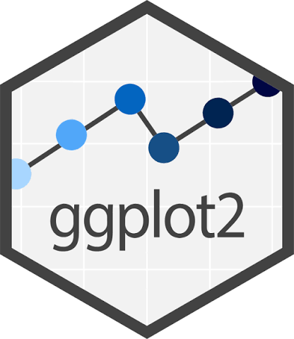

## 0. Recordatorio: Qué es un paquete o una librería en R?

Un paquete o librería en R es un conjunto de funciones, datos y documentación que amplía las capacidades del lenguaje R. Los paquetes permiten a los usuarios realizar tareas específicas sin tener que escribir todo el código desde cero. Los más usados en R son:

- dplyr: para manipulación de datos.
- ggplot2: para visualización de datos.
- haven: para importar y exportar datos.
- readr: para leer y escribir archivos de datos.
- survey: para análisis de encuestas con diseño complejo.

::: {.callout-note}
Además, existen paquetes especializados en contextos específicos, entre ellos diversos paquetes desarrollados para trabajar con datos de Chile. Por ejemplo, **chilemapas** permite trabajar con mapas de Chile y sus distintas regiones; **chileapi** facilita el acceso a datos provenientes de las API del Gobierno de Chile; y **calidad**, desarrollado por el INE, está orientado a la evaluación de estándares de calidad en estadísticas y encuestas oficiales. Estos paquetes amplían las posibilidades de R para el análisis de datos y permiten adaptar sus herramientas a necesidades específicas del contexto nacional.
:::


## 1. Qué es ggplot2?

{fig-align="center" width="200px"}

ggplot2 es un paquete para crear gráficos de forma flexible. La idea es construir los gráficos por capas, agregando elementos uno a uno.

### 1.1 Orden de construcción de un gráfico con ggplot2

{fig-align="center" width="400px"}

El orden va más o menos así:

- ⁠Data: la base de datos que vamos a graficar.
- ⁠Mapping: qué variables van en los ejes, colores, tamaños, etc.
- ⁠Layers: qué tipo de gráfico queremos (barras, puntos, líneas, etc.) y cómo se ve.
- ⁠Scales: cómo se ven los ejes, colores, tamaños, etc. Básicamente el tamaño.
- ⁠Facets: si queremos separar el gráfico en paneles según alguna variable.
- ⁠Coordinates: si queremos cambiar la orientación del gráfico o usar coordenadas polares.
- ⁠Theme: cómo se ve el gráfico en general (colores, tipografía, etc.).

Sin embargo, las más básicas son estas tres: *data, mapping y layers.* Todo lo demás es opcional.


## 2. Fortalezas y debilidades de ggplot2

 
| **Característica** | **Fortalezas (Ventajas)** | **Debilidades** |
|---|---|---|
| **Diseño y Estructura** | Estructura lógica y consistente basada en capas. | Curva de aprendizaje inicial pronunciada para principiantes. |
| **Calidad Visual** | Gráficos con calidad de publicación por defecto. | Personalizar detalles minuciosos puede requerir código muy largo. |
| **Flexibilidad** | Alta flexibilidad para combinar diferentes tipos de gráficos. | No está diseñado para gráficos tridimensionales (3D). |
| **Interactividad** | Excelente integración con extensiones modernas. | Los gráficos nativos son estáticos, no interactivos. |
| **Rendimiento** | Excelente manejo de datos bien estructurados (*tidy data*). | Puede volverse lento con conjuntos de datos muy grandes. |

## 3. Nuestra base de datos: Propinas

Trabajaremos con una base de datos de propinas en un restaurante. 

Algunas de sus variables son:

- **total_bill**: Monto total de la cuenta (en dólares).
- **tip**: Monto de la propina (en dólares).
- **sex**: Sexo del cliente que pagó la cuenta (Male o Female).
- **smoker**: Indica si el cliente es fumador (Yes o No).
- **day**: Día de la semana en que se realizó la transacción (Thur, Fri, Sat, Sun).
- **time**: Momento del día en que se realizó la transacción (Lunch o Dinner).

### 3.1 Cargar librerías necesarias

Cargaremos las librerías necesarias para trabajar con la base de datos y crear gráficos, `tidyverse` y `ggplot2`. Si tu computador no tiene instalado alguno de estos paquetes, puedes instalarlos con `install.packages("nombre_del_paquete")`. 
```{r}
# Cargar librerías necesarias
library(tidyverse)
library(ggplot2)
# Si tu computador no tiene instalado los paquetes tidyverse ni ggplot2, puedes instalarlos con:
# install.packages("tidyverse")
# install.packages("ggplot2")
#Asegurate de sacarle el "#"!
```

## 4. Cargar la base de datos

Para cargar la base de datos, utilizamos la función `read_csv()` del paquete `readr`, que forma parte del conjunto de paquetes `tidyverse`. Esta función permite leer archivos CSV y convertirlos en un *data frame* de R.

```{r}
# Cargar la base de datos de propinas
tips <- read_csv("https://raw.githubusercontent.com/mwaskom/seaborn-data/master/tips.csv")
```

## 5. Tipos de gráficos en ggplot2

Existen múltiples tipos de gráficos que podemos crear con ggplot2, cada uno con distintas características y usos, entre ellos:

- **Gráfico de dispersión (scatter plot)**: útil para visualizar la relación entre dos variables continuas.
- **Gráfico de líneas (line plot)**: útil para mostrar tendencias a lo largo del tiempo.
- **Gráfico de barras (bar plot)**: útil para comparar cantidades entre diferentes categorías.
- **Histograma (histogram)**: útil para mostrar la distribución de una variable continua.
- **Boxplot (gráfico de caja)**: útil para mostrar la distribución de una variable continua y detectar valores atípicos.
- **Gráfico de densidad (density plot)**: útil para estimar la distribución de una variable continua.
- **Gráfico de violín (violin plot)**: combina características del boxplot y del density plot para mostrar la distribución de una variable continua.

Hoy veremos cómo crear un histograma, un boxplot y un gráfico de barras.

### 5.1 Histograma: ¿cómo se distribuye la propina?


```{r}
# Crear un histograma de la distribución de las propinas
tips |> 
  ggplot(aes(x = tip)) +
  geom_histogram(bins = 30, fill = "darkgreen", color = " black") +
  labs(
    title = "Distribución de las propinas",
    x = "Propina (dólares)",
    y = "Número de transacciones"
  )
```

##### Desglosemos el código:

1) tips |> ggplot(aes(x = tip)): indica que vamos a graficar la variable `tip` de la base de datos `tips`. Aes es la función que define los *aesthetics* del gráfico, en este caso el eje x.
2) geom_histogram(bins = 30, fill = "darkgreen", color = "white"): crea un histograma con 30 bins(número total de barras), relleno en verde oscuro (darkgreen) y borde negro (black).
3) labs(): agrega etiquetas al gráfico, incluyendo el título y los ejes.


::: {.callout-note}
Con ggplot2 usamos "+" para agregar capas al gráfico. Cada capa puede ser un tipo de gráfico, una escala, un tema, etc. En este caso, agregamos un histograma y etiquetas al gráfico.

Recordemos además que |> es un pipe, al igual que %>%, que nos permite encadenar funciones de manera más legible.
:::

#### 5.1.1 Cómo interpretar el histograma

A partir de la visualización, podemos afirmar que la mayoría de las propinas están concentradas entre 1 y 5 dólares, con un pico alrededor de los 2 dólares. Esto indica que la distribución de las propinas es asimétrica hacia la derecha, con algunas propinas más altas que son menos frecuentes.

Por tanto, usamos el histograma para visualizar la distribución de una variable continua y detectar patrones o tendencias en los datos. 

### 5.2 Boxplot: comparando propinas según el sexo del cliente

```{r}
tips |> 
  ggplot(aes(x = sex, y = tip)) +
  geom_boxplot(fill = "lightblue") +
  labs(
    title = "Propinas por sexo",
    x = "Sexo",
    y = "Propina (dólares)"
  )
```

##### Desglosemos el código:

1) tips |> ggplot(aes(x = sex, y = tip)): indica que vamos a graficar la variable `tip` de la base de datos `tips`, donde `sex` es la variable independiente (eje x) y `tip` es la variable dependiente (eje y).
2) geom_boxplot(fill = "lightblue"): crea un boxplot con relleno azul claro (lightblue).
3) labs(): agrega etiquetas al gráfico, incluyendo el título y los ejes.

#### 5.2.1 Cómo interpretar el boxplot

A partir de la visualización, podemos observar que las propinas tienden a ser ligeramente más altas para los clientes masculinos en comparación con los femeninos. Además, el boxplot nos permite identificar posibles valores atípicos (outliers) en ambas categorías.


### 5.3 Gráfico de barras: comparando propinas según el día de la semana

```{r}
tips |> 
  ggplot(aes(x = day, y = tip)) +
  geom_bar(stat = "summary", fun = "mean", fill = "orange") +
  labs(
    title = "Propinas promedio por día de la semana",
    x = "Día de la semana",
    y = "Propina promedio (dólares)"
  )
```

##### Desglosemos el código:

1) tips |> ggplot(aes(x = day, y = tip)): indica que vamos a graficar la variable `tip` de la base de datos `tips`, donde `day` es la variable independiente (eje x) y `tip` es la variable dependiente (eje y).
2) geom_bar(stat = "summary", fun = "mean", fill = "orange"): crea un gráfico de barras donde cada barra representa la propina promedio para cada día de la semana, con relleno naranja (orange).ç

::: {.callout-note}
Con fun = "mean" le indicamos a ggplot2 que queremos calcular la media de las propinas para cada día de la semana. Podría ser cualquier otra función de resumen, como la mediana (fun = "median") o la suma (fun = "sum").
Con stat = "summary" le indicamos a ggplot2 que queremos resumir los datos en lugar de contar la cantidad de observaciones.
:::

#### 5.3.1 Cómo interpretar el histograma

A partir de la visualización, podemos observar que las propinas promedio tienden a ser más altas los fines de semana (sábado y domingo) en comparación con los días de semana (jueves y viernes). Esto podría deberse a que los clientes tienden a gastar más durante el fin de semana, lo que se refleja en propinas más generosas.

## 6. Conclusión

En esta sesión, hemos aprendido a utilizar ggplot2 para crear visualizaciones de datos en R. Hemos explorado diferentes tipos de gráficos, como histogramas, boxplots y gráficos de barras, y hemos aprendido a interpretar los resultados obtenidos. Además, hemos discutido las fortalezas y debilidades de ggplot2 como herramienta de visualización de datos.

## 7 Personalización

Se pueden usar muchos colores, y se pueden personalizar los gráficos de muchas maneras. Por ejemplo, podemos cambiar el tema del gráfico, agregar etiquetas, cambiar los colores de las barras o líneas, entre otros.

Con colores como orange, lightblue, darkgreen, etc., podemos hacer que nuestros gráficos sean más atractivos y fáciles de interpretar. Además, podemos usar funciones como `theme()` para cambiar la apariencia general del gráfico, incluyendo el fondo, las fuentes y los tamaños de los elementos.

## Ahora te toca a ti!

1) Crea un histograma de la variable `total_bill` para visualizar la distribución de los montos totales de las cuentas en el restaurante. Ajusta el número de bins según lo consideres necesario y personaliza los colores del gráfico.

2) Crea un boxplot para comparar las propinas según si el cliente es fumador o no. Analiza los resultados y comenta si hay diferencias importantes entre ambos grupos.


