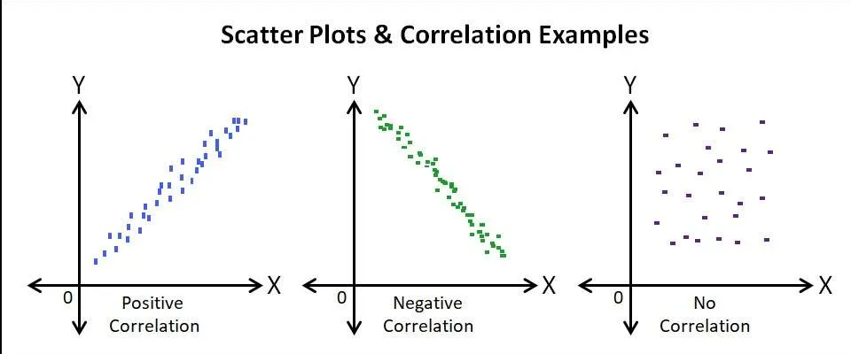
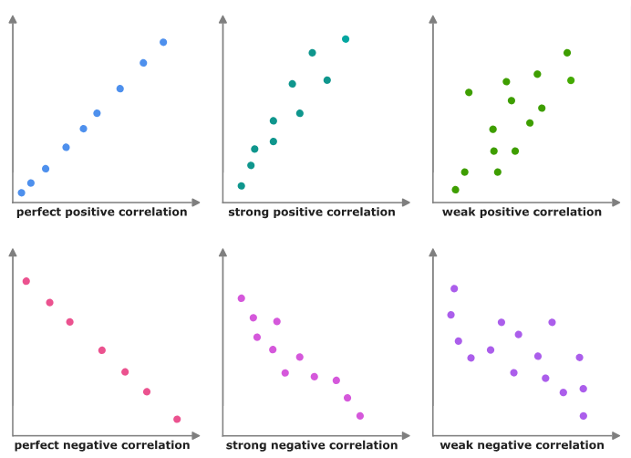
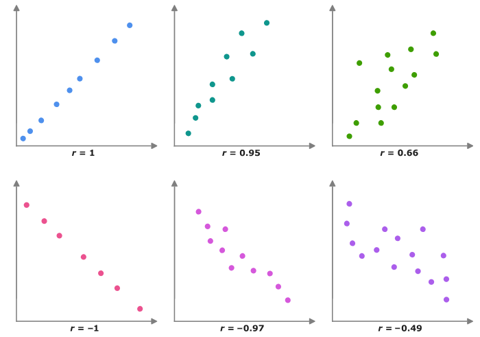

# Qué veremos?

::: {.incremental}
1) Tipos de variables
2) Correlación
3) Inferencia
:::

# Tipos de variable

Existen distintos tipos de variables, cada una respondiendo a su nivel de medición. Pueden ser cualitativas y cuantitativas.

::: {.incremental}
- Variables nominales
- Variables ordinales
- Variables intervalares (o de intervalo)
- Variables de razón
:::
---

## Variable nominal

Variable que representa categorías sin un orden específico. Ejemplos: color de ojos, tipo de sangre.

---

## Variable ordinal

Variable que representa categorías con un orden específico, pero sin una distancia uniforme entre ellas. Ejemplos: nivel educativo (primaria, secundaria, universidad), clasificación de satisfacción (bajo, medio, alto).

---

## Variable de intervalo

Variable que representa categorías con un orden específico y una distancia uniforme entre ellas, pero sin un punto cero absoluto. Ejemplos: temperatura en grados Celsius o Fahrenheit, años del calendario.

---

## Variable de razón

Variable que representa categorías con un orden específico, una distancia uniforme entre ellas y un punto cero absoluto. Ejemplos: altura, peso, edad.

---

## Continua o discreta?

Otra clasificación de las variables cuantitativas es si son continuas o discretas.

---

### Variables discretas

Son aquellas que solo pueden tomar valores enteros y contables. Ejemplos: número de hijos, número de autos en un hogar.

### Variables continuas

Son aquellas que sí pueden tomar cualquier valor dentro de un rango, incluyendo decimales. Ejemplos: altura, peso, temperatura.

---

::: {.tabla-resumen}
| Naturaleza | Nivel de medición | ¿Cuándo se usa? | Ejemplo |
|---|---|---|---|
| Cualitativa | Nominal | Cuando las categorías no tienen ningún orden lógico entre sí | Sexo, nacionalidad, color de ojos |
| Cualitativa | Ordinal | Cuando las categorías sí tienen un orden, pero la distancia entre ellas no es constante ni medible | Nivel educacional, escala Likert (muy en desacuerdo a muy de acuerdo) |
| Cuantitativa discreta | Intervalo | Cuando los valores son numéricos enteros/contables, con distancias iguales pero **sin cero absoluto** (el cero es arbitrario) | Año calendario, número de siglo o década |
| Cuantitativa discreta | Razón | Cuando los valores son numéricos enteros/contables, con distancias iguales y **con cero absoluto** | Número de hijos, número de goles, cantidad de hermanos |
| Cuantitativa continua | Intervalo | Cuando los valores pueden tomar cualquier valor dentro de un rango (decimales incluidos), con distancias iguales pero **sin cero absoluto** | Temperatura en °C |
| Cuantitativa continua | Razón | Cuando los valores pueden tomar cualquier valor dentro de un rango (decimales incluidos), con distancias iguales y **con cero absoluto** | Edad, ingreso, peso, velocidad (km/h) |
:::

---

### Por qué es importante conocer el tipo de variable?

Es importante conocer el tipo de variable porque nos permite elegir las técnicas estadísticas adecuadas para analizar los datos. Por ejemplo, algunas pruebas estadísticas requieren variables de razón o intervalo, mientras que otras pueden aplicarse a variables ordinales o nominales.

# Correlación

La correlación es una medida estadística que indica la relación entre dos variables. Se utiliza para determinar si existe una relación lineal entre ellas y, en caso afirmativo, qué tan fuerte es esa relación.

---

{width="75%" fig-align="center"}

---

{width="75%" fig-align="center"}

---

{width="75%" fig-align="center"}

---

## Cómo interpretamos una correlación?

Probemos [Aquí](https://gabcortes97.github.io/correlacion/significancia-correlacion.html) con un ejemplo interactivo.

## Coeficientes

### Coeficientes de correlación

Las interpretaciones de los coeficientes de correlación varían según el tipo de variable y la relación que se esté evaluando. Los más comunes son:

::: {.incremental}
- Coeficiente de correlación de Pearson (r): mide la relación lineal entre dos variables continuas. Su valor varía entre -1 y 1, donde -1 indica una correlación negativa perfecta, 0 indica ausencia de correlación y 1 indica una correlación positiva perfecta.
:::
---- 

::: {.incremental}
Coeficiente de correlación de Spearman (ρ o rs): mide la relación monotónica entre dos variables ordinales o continuas. Su valor también varía entre -1 y 1, **con interpretaciones similares a las del coeficiente de Pearson.**

- Coeficiente de correlación de Kendall (τ): mide la relación ordinal entre dos variables. Su valor varía entre -1 y 1, **con interpretaciones similares a las del coeficiente de Pearson.**
:::

::: {.incremental}

- 

:::